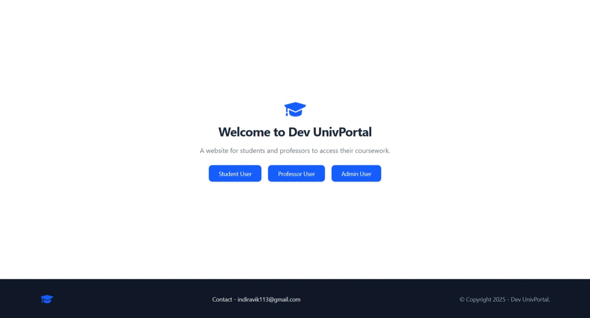
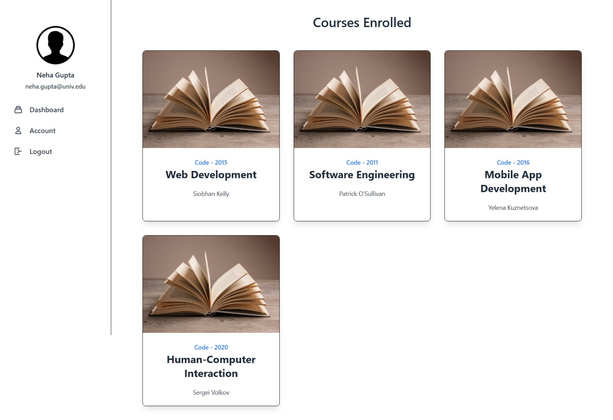
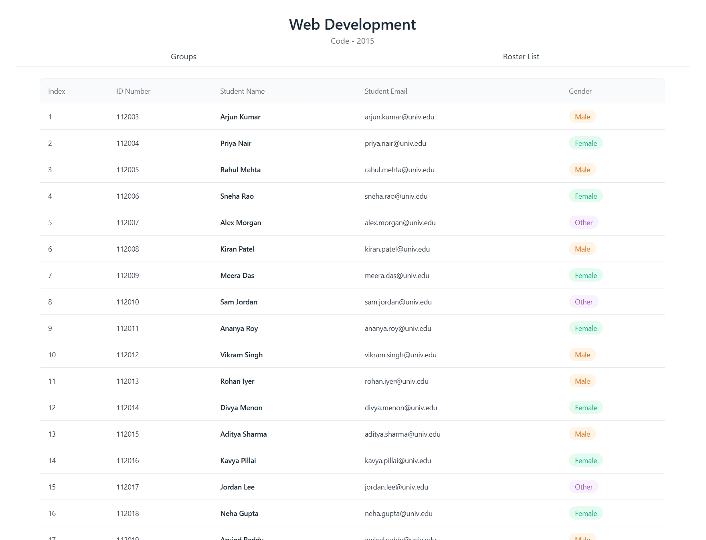
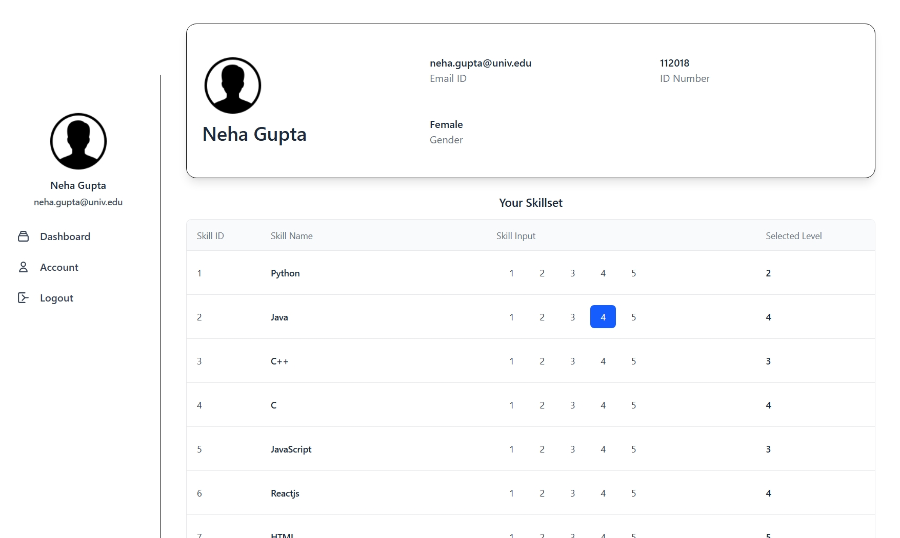
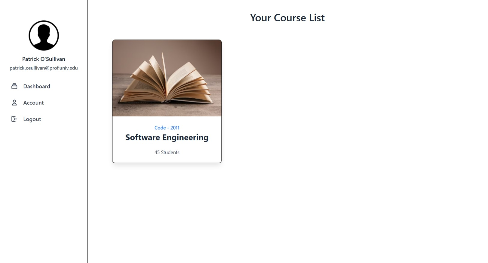
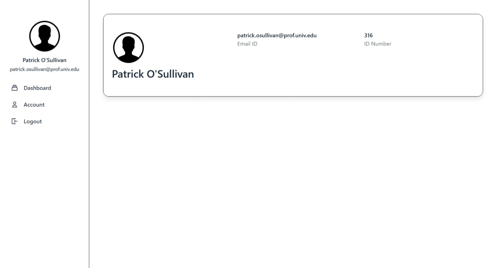
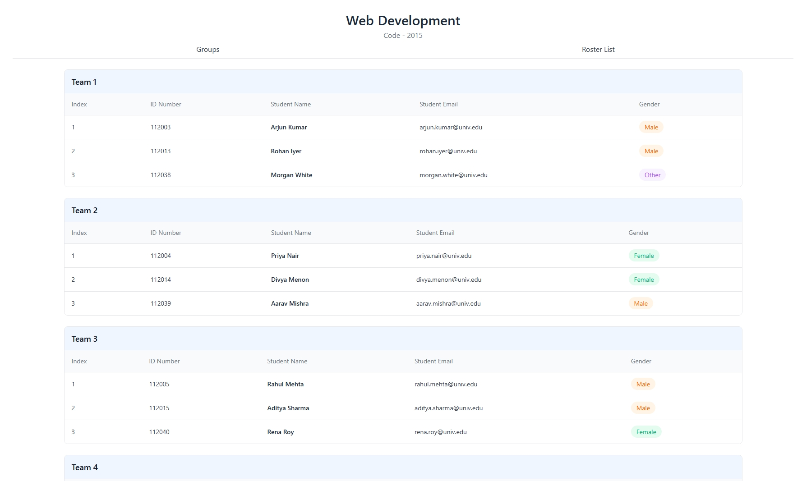
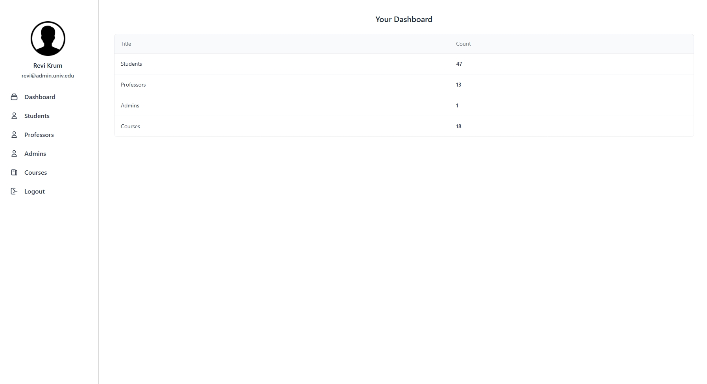

# Dev teams UnivPortal
A simple team formation website for professors and students.

## Tech-Stack
- PostgreSQL
- Prisma
- GraphQL
- Vue.js
- TypeScript
- TailwindCSS

## Commands for localhost
- Move to `client` folder and run `serve -s dist -l 5173` to start the backend
- Move to `server` folder and run `node dist/index.js` to start the frontend
- And change the DATABASE URL in the `.env` in the server folder for setting up the localhost

## Commands for Docker
- Open project and enter `docker compose -d --build`

## Sample Login Creds
Student Login\
Email: `neha.gupta@univ.edu`\
Password: `Neha%919`

Professor Login\
Email: `patrick.osullivan@prof.univ.edu`\
Password: `Patrick*654`

Admin Login\
Email: `revi@admin.univ.edu`\
Password: `revi@1`

## Screenshots

